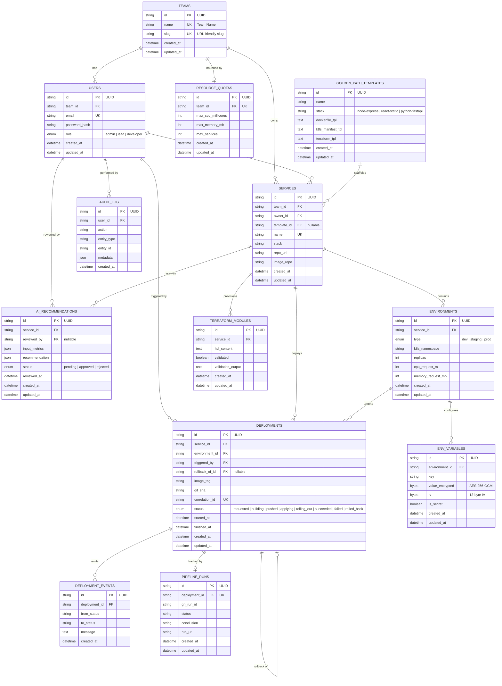

# Database Entity-Relationship Diagram

Generated from Prisma Schema (`apps/api/prisma/schema.prisma`).

```mermaid
erDiagram
    TEAMS ||--o{ USERS : "has"
    TEAMS ||--o| RESOURCE_QUOTAS : "bounded by"
    TEAMS ||--o{ SERVICES : "owns"
    
    USERS ||--o{ SERVICES : "created by (owner)"
    USERS ||--o{ DEPLOYMENTS : "triggered by"
    USERS ||--o{ AI_RECOMMENDATIONS : "reviewed by"
    USERS ||--o{ AUDIT_LOG : "performed by"

    GOLDEN_PATH_TEMPLATES ||--o{ SERVICES : "scaffolds"

    SERVICES ||--o{ ENVIRONMENTS : "contains"
    SERVICES ||--o{ DEPLOYMENTS : "deploys"
    SERVICES ||--o{ AI_RECOMMENDATIONS : "receives"
    SERVICES ||--o{ TERRAFORM_MODULES : "provisions"

    ENVIRONMENTS ||--o{ ENV_VARIABLES : "configures"
    ENVIRONMENTS ||--o{ DEPLOYMENTS : "targets"

    DEPLOYMENTS ||--o{ DEPLOYMENT_EVENTS : "emits"
    DEPLOYMENTS ||--o| PIPELINE_RUNS : "tracked by"
    DEPLOYMENTS ||--o| DEPLOYMENTS : "rollback of"

    TEAMS {
        string id PK "UUID"
        string name UK "Team Name"
        string slug UK "URL-friendly slug"
        datetime created_at
        datetime updated_at
    }

    USERS {
        string id PK "UUID"
        string team_id FK
        string email UK
        string password_hash
        enum role "admin | lead | developer"
        datetime created_at
        datetime updated_at
    }

    RESOURCE_QUOTAS {
        string id PK "UUID"
        string team_id FK "UK"
        int max_cpu_millicores
        int max_memory_mb
        int max_services
        datetime created_at
        datetime updated_at
    }

    GOLDEN_PATH_TEMPLATES {
        string id PK "UUID"
        string name
        string stack "node-express | react-static | python-fastapi"
        text dockerfile_tpl
        text k8s_manifest_tpl
        text terraform_tpl
        datetime created_at
        datetime updated_at
    }

    SERVICES {
        string id PK "UUID"
        string team_id FK
        string owner_id FK
        string template_id FK "nullable"
        string name UK
        string stack
        string repo_url
        string image_repo
        datetime created_at
        datetime updated_at
    }

    ENVIRONMENTS {
        string id PK "UUID"
        string service_id FK
        enum type "dev | staging | prod"
        string k8s_namespace
        int replicas
        int cpu_request_m
        int memory_request_mb
        datetime created_at
        datetime updated_at
    }

    ENV_VARIABLES {
        string id PK "UUID"
        string environment_id FK
        string key
        bytes value_encrypted "AES-256-GCM"
        bytes iv "12-byte IV"
        boolean is_secret
        datetime created_at
        datetime updated_at
    }

    DEPLOYMENTS {
        string id PK "UUID"
        string service_id FK
        string environment_id FK
        string triggered_by FK
        string rollback_of_id FK "nullable"
        string image_tag
        string git_sha
        string correlation_id UK
        enum status "requested | building | pushed | applying | rolling_out | succeeded | failed | rolled_back"
        datetime started_at
        datetime finished_at
        datetime created_at
        datetime updated_at
    }

    DEPLOYMENT_EVENTS {
        string id PK "UUID"
        string deployment_id FK
        string from_status
        string to_status
        text message
        datetime created_at
    }

    PIPELINE_RUNS {
        string id PK "UUID"
        string deployment_id FK "UK"
        string gh_run_id
        string status
        string conclusion
        string run_url
        datetime created_at
        datetime updated_at
    }

    AI_RECOMMENDATIONS {
        string id PK "UUID"
        string service_id FK
        string reviewed_by FK "nullable"
        json input_metrics
        json recommendation
        enum status "pending | approved | rejected"
        datetime reviewed_at
        datetime created_at
        datetime updated_at
    }

    TERRAFORM_MODULES {
        string id PK "UUID"
        string service_id FK
        text hcl_content
        boolean validated
        text validation_output
        datetime created_at
        datetime updated_at
    }

    AUDIT_LOG {
        string id PK "UUID"
        string user_id FK
        string action
        string entity_type
        string entity_id
        json metadata
        datetime created_at
    }
```

